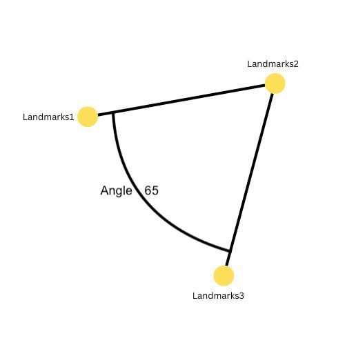

# Angle Between Landmarks

This is a lightweight library that is capable to calculate the degree angle between three landmarks.



**Note:** "Landmarks2" must be the origin as shown in the picture and all the landmarks must be normalized according to the screen.

## Installation

Install angle-between-landmarks with npm/yarn

```bash
  npm install angle-between-landmarks // npm
  yarn add angle-between-landmarks // yarn
```

## Usage/Examples

#### Import

```javascript
import findAngle from 'angle-between-landmarks'; // ES6
const findAngle = require('angle-between-landmarks'); // CommonJS
```

#### Data

```javascript
const landmarks1 = { x: 0, y: 0 };
const landmarks2 = { x: 1, y: 0 }; // Middle one must be the origin
const landmarks3 = { x: 1, y: 1 };
const opt = { small: false, round: true} // default { small: false, round: true }
```

#### Usage

```javascript
let anngle = findAngle(landmarks1, landmarks2, landmarks3, opt);
```

## Contributing

- Fork it!
- Create your feature branch: `git checkout -b my-new-feature`
- Commit your changes: `git commit -am 'Add some feature'`
- Push to the branch: `git push origin my-new-feature`
- Submit a pull request :D

## Author

**angle-between-landmarks** © [Yousuf](https://github.com/yousufkalim)  
Authored and maintained by Yousuf Kalim.

> GitHub [@yousufkalim](https://github.com/yousufkalim) · LinkedIn [@yousufkalim](https://www.linkedin.com/in/yousufkalim/)

## License

[MIT](https://choosealicense.com/licenses/mit/)
